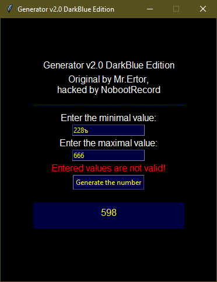

# Generator v2.0 DarkBlue Edition

Random number generator written in pure Python 3 using Tkinter as GUI framework.\
Original of the program was written by my friend [Mr. Ertor](https://github.com/MrErtor). You can discover original source codes at [his](https://github.com/MrErtor/Generator) repository.
I created this Generator mod just for fun :)

Features of DarkBlue Edition:
* Dark blue-colored theme (that's why it is called DarkBlue lol)
* English-language GUI (originally it was in Russian) with some minor bugs fixed

Most of the source code of the program has NOT been modified, so performance of the program was not changed anyway.

----------------------

Генератор случайных чисел, написанный на чистом Python 3 с использованием графического фреймворка Tkinter.\
Оригинал сей замечательной программы был написан моим другом по имени [Mr. Ertor](https://github.com/MrErtor). Оригинальные исходники программы можно посмотреть у него в [репозитории](https://github.com/MrErtor/Generator).
Модификация данной программы была сделана мной чисто по приколу, не более :)

Что нового в DarkBlue Edition по сравнению с оригиналом?
* Тёмно-синяя тема оформления (отсюда и название модификации, лол)
* Интерфейс программы был переведён на английский язык (в оригинале был русский), были исправлены кое-какие косяки с ним

Большая часть исходного кода программы НЕ была как-либо изменена, поэтому на её работу в целом это всё никак не должно влиять.

